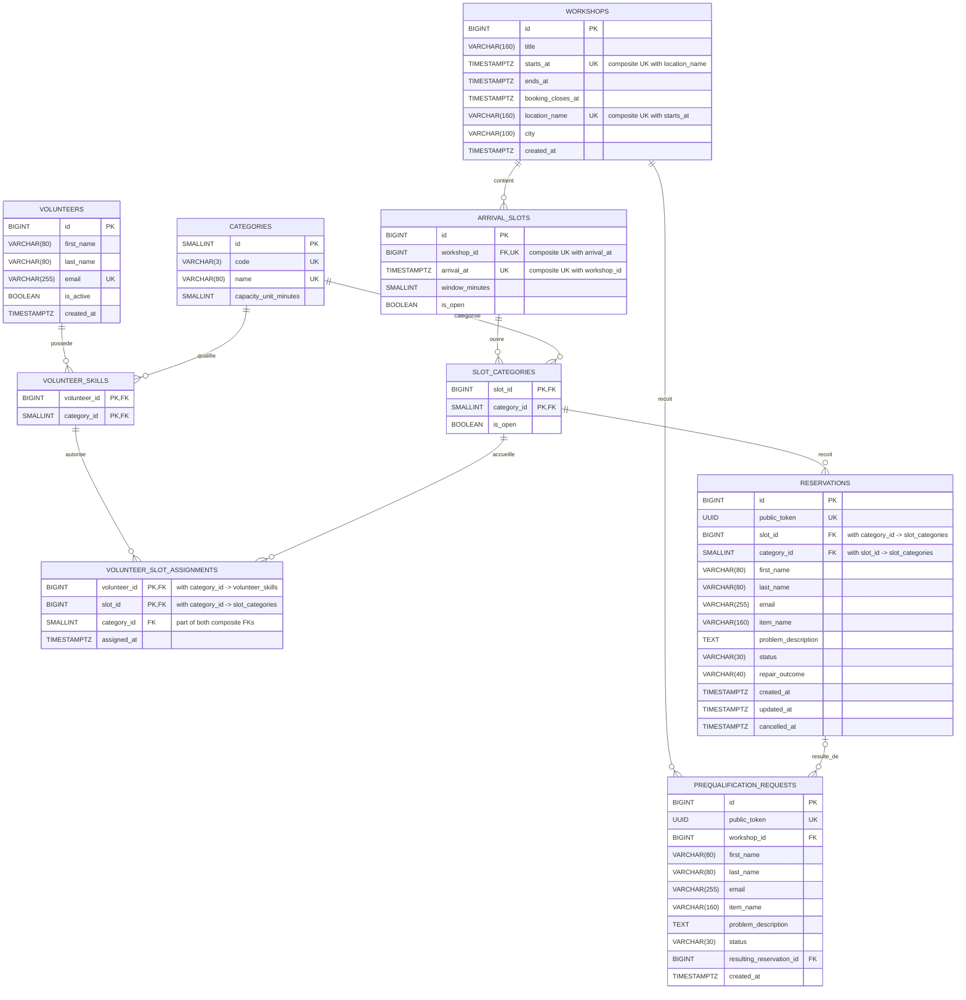

# Modèle relationnel — Atelier Solidaire

## Objectif

La base de données PostgreSQL conserve les informations nécessaires à
l'organisation des ateliers, aux capacités par catégorie, aux affectations
des bénévoles et aux réservations des participants.

Elle sépare volontairement :

- les compétences d'un bénévole ;
- son affectation effective à un créneau ;
- les demandes nécessitant une préqualification ;
- les réservations réellement rattachées à une catégorie et à un créneau.

## Entités principales

### workshops

Représente un atelier organisé à une date et dans un lieu précis.

Un atelier possède plusieurs créneaux d'arrivée.

### arrival_slots

Représente une heure d'arrivée et de première prise en charge.

Un créneau n'est pas une durée de réparation garantie.

### categories

Contient les catégories réservables :

- Informatique ;
- Petit électroménager ;
- Couture & textile.

Chaque catégorie possède une unité de capacité exprimée en minutes.

### slot_categories

Association entre un créneau et les catégories ouvertes sur ce créneau.

### volunteers

Contient les bénévoles pouvant participer aux ateliers.

### volunteer_skills

Association entre les bénévoles et leurs compétences.

Un bénévole peut posséder plusieurs compétences.

### volunteer_slot_assignments

Représente l'affectation réelle d'un bénévole à une catégorie sur un créneau.

La clé primaire `(volunteer_id, slot_id)` empêche qu'un même bénévole
soit compté plusieurs fois sur le même créneau, même s'il possède plusieurs
compétences.

Les deux clés étrangères composites imposent également que l'affectation
corresponde à une compétence existante et à une catégorie effectivement
ouverte sur le créneau.

### reservations

Contient les réservations rattachées à une combinaison créneau/catégorie.

Les informations participant sont stockées avec la réservation afin de ne
pas imposer la création d'un compte utilisateur permanent.

Un UUID public distinct de l'identifiant technique est généré pour permettre
ultérieurement l'accès sécurisé à une réservation depuis le Backend.

### prequalification_requests

Contient les demandes « Je ne sais pas / autre ».

Ces demandes ne sont pas considérées immédiatement comme des réservations :
elles doivent d'abord être examinées par l'association. Une demande peut
référencer une réservation résultante après acceptation.

## Règles de nommage

Les conventions observées dans `database/migrations/001_schema.sql` sont les suivantes :

- les tables utilisent le `snake_case` et des noms au pluriel, par exemple
  `arrival_slots`, `volunteer_skills` et `prequalification_requests` ;
- les tables d'entité utilisent généralement une clé primaire `id` générée,
  tandis que les tables d'association utilisent des clés primaires composites ;
- les colonnes de clé étrangère suivent la forme `<entité>_id`, par exemple
  `workshop_id`, `category_id`, `slot_id` et `volunteer_id` ;
- les dates et heures utilisent le suffixe `*_at`, par exemple `starts_at`,
  `arrival_at`, `created_at`, `updated_at` et `cancelled_at` ;
- les booléens utilisent le préfixe `is_*`, comme `is_open` et `is_active` ;
- les contraintes explicitement nommées utilisent les préfixes `chk_` pour
  les contrôles, `uq_` pour les contraintes d'unicité et `fk_` pour les
  clés étrangères composites ;
- les index explicitement nommés utilisent le préfixe `idx_`.

Certaines clés étrangères simples et certaines contraintes `UNIQUE` sont
déclarées directement sur la colonne dans le schéma ; PostgreSQL leur attribue
alors son nom de contrainte par défaut.

## Relations

Le diagramme ci-dessous reprend les colonnes et relations déclarées dans
`001_schema.sql`. Les marqueurs `UK` placés sur plusieurs colonnes peuvent
désigner une contrainte d'unicité composite, précisée dans le commentaire.

